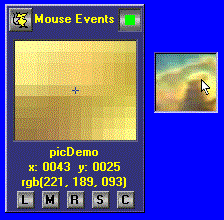



## Mouse Events

### Description

A UserControl that will capture and report mouse events on form and child controls. I've found it useful for finding position and color info at runtime when working with picure objects and when doing bitmap manipulation.
 
### More Info
 

             |
---                |---
**Submitted On**   |2001-03-20 14:14:58
**By**             |[Jim Benvenuti](https://github.com/Planet-Source-Code/PSCIndex/blob/master/ByAuthor/jim-benvenuti.md)
**Level**          |Advanced
**User Rating**    |4.7 (14 globes from 3 users)
**Compatibility**  |VB 6\.0
**Category**       |[Custom Controls/ Forms/  Menus](https://github.com/Planet-Source-Code/PSCIndex/blob/master/ByCategory/custom-controls-forms-menus__1-4.md)
**World**          |[Visual Basic](https://github.com/Planet-Source-Code/PSCIndex/blob/master/ByWorld/visual-basic.md)
**Archive File**   |[CODE\_UPLOAD173623202001\.zip](https://github.com/Planet-Source-Code/jim-benvenuti-mouse-events__1-21781/archive/master.zip)

### API Declarations

in ApiMod.bas

